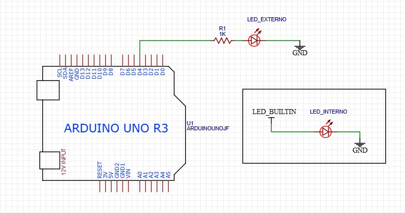
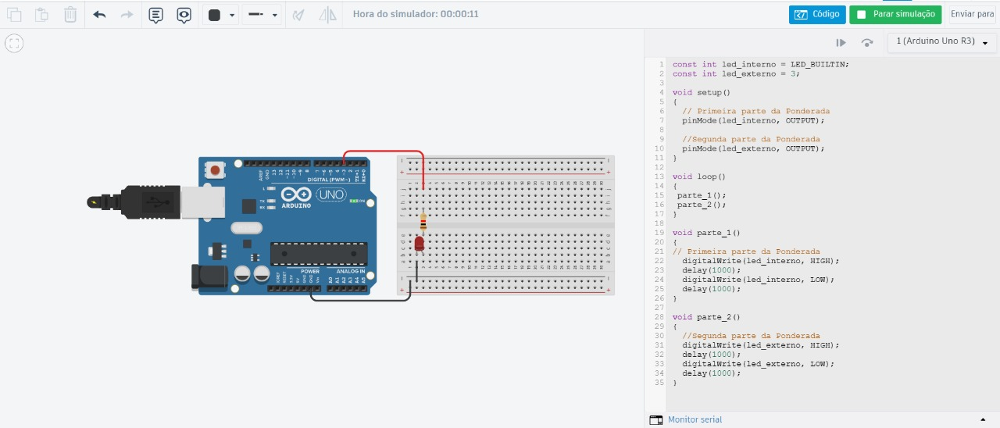
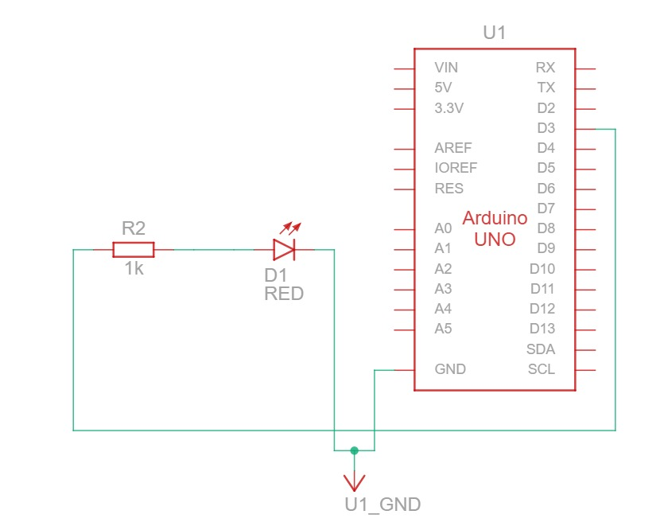
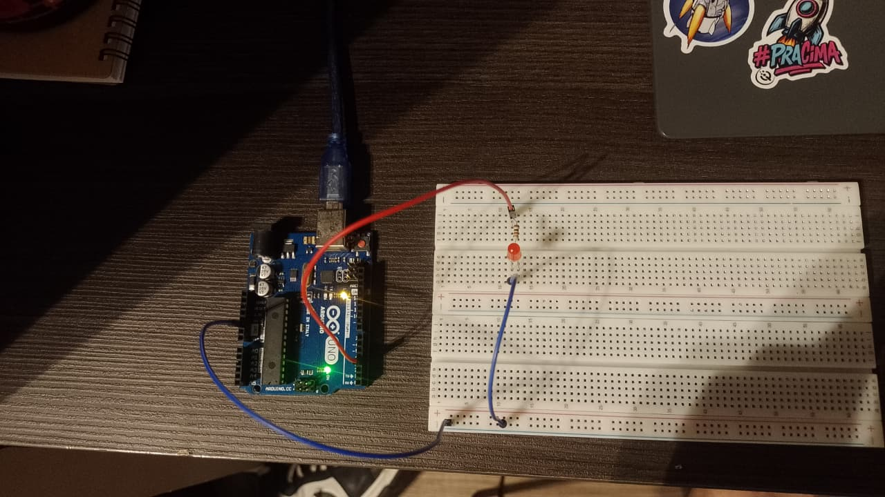
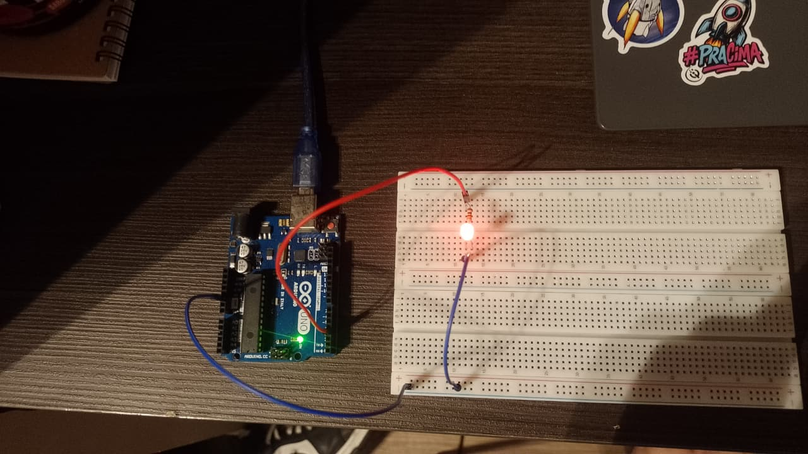
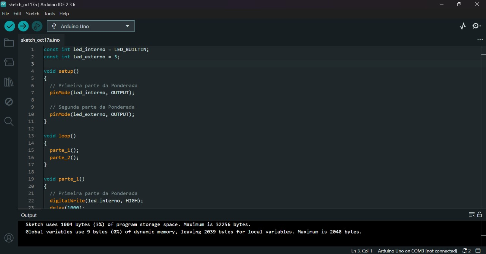
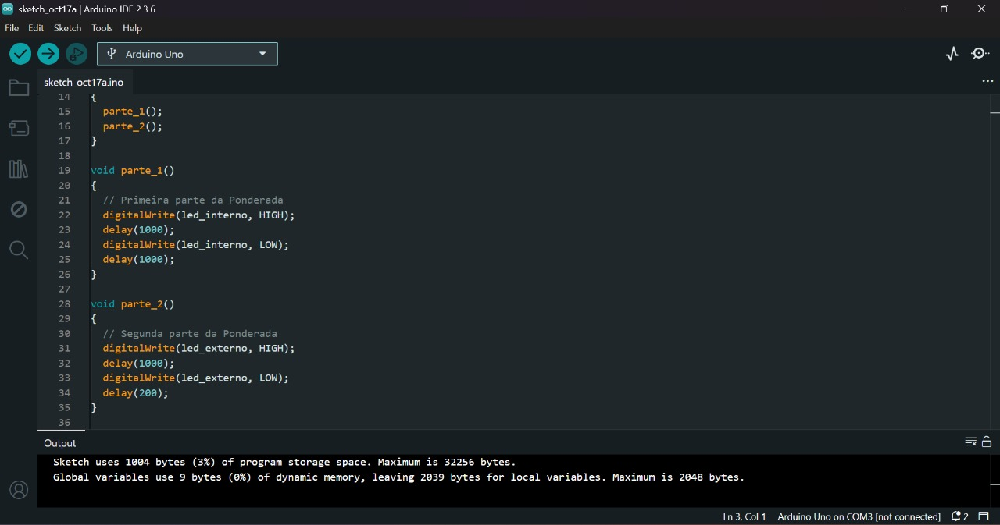

## Ponderada 01 — Blink LED Interno e Externo (Arduino)

**Descrição**

Este projeto tem como objetivo realizar dois experimentos utilizando o Arduino UNO, explorando o comportamento de saídas digitais:

**Parte 1 — Blink do LED Interno:**
Fazer o LED embutido do Arduino piscar em um intervalo de tempo definido.

**Parte 2 — Simulação de Blink Externo:**
Criar uma simulação no TinkerCad com um LED externo conectado a uma porta digital, realizando o mesmo comportamento de piscar.


**Esquemático Elétrico Geral**

<div align="center">
    <strong style="font-size: 18px;"><sub>Esquemático Elétrico </sub></strong><br>
<br>
    <sup>Fonte: Desenvolvido através do EasyEda</sup>
  </div>

**Bill of Materials (BOM)**  

Circuito Arduino com LED Interno e Externo

| **Item** | **Componente**            | **Descrição**                                                | **Quantidade**      | **Referência** | **Observações**                             |
| -------- | ------------------------- | ------------------------------------------------------------ | ------------------- | -------------- | ------------------------------------------- |
| 1        | Arduino Uno R3            | Microcontrolador ATmega328P, 14 pinos digitais, 6 analógicos | 1                   | U1             | Alimentação 5V / 12V (entrada Jack ou USB)  |
| 2        | LED externo               | LED vermelho (ou outro) de 5mm                               | 1                   | LED_EXTERNO    | Conectado ao pino digital D3 via resistor   |
| 3        | Resistor 1kΩ              | Resistor limitador de corrente para o LED externo            | 1                   | R1             | ¼ W, tolerância 5%                          |
| 4        | LED interno (LED_BUILTIN) | LED integrado na placa Arduino Uno (pino 13)                 | 1                   | LED_INTERNO    | Indicação visual onboard                    |
| 5        | Fios de conexão           | Jumpers macho-macho                                          | conforme necessário | —              | Para conexões entre o LED externo e a placa |

**Ligações Principais**

**- LED externo:**
Anodo → Pino digital D3
Cátodo → GND (através do resistor de 1 kΩ)

**- LED interno (built-in):**
Controlado pelo pino 13 (LED_BUILTIN) do Arduino

## Parte 1 — Blink LED Interno

**Objetivo**

Programar o LED interno do Arduino UNO para acender e apagar em um loop contínuo, simulando uma “luz piscando”.

**Passos realizados:**
1. Desenvolvimento de Esquemático Elétrico.
2. Prototipagem e Teste via Tinkercad.
3. Instalação da Arduino IDE.
4. Desenvolvimento e upload do código para o Arduino UNO.
5. Teste prático do LED interno piscando.

**Código Utilizado**

```jsx
const int led_interno = LED_BUILTIN;
// const int led_externo = 3;

void setup()
{
  // Primeira parte da Ponderada
  pinMode(led_interno, OUTPUT);
  
  // Segunda parte da Ponderada
  //pinMode(led_externo, OUTPUT);
}

void loop()
{
  parte_1();
  //parte_2();
}

void parte_1()
{
  // Primeira parte da Ponderada
  digitalWrite(led_interno, HIGH);
  delay(1000); 
  digitalWrite(led_interno, LOW);
  delay(1000); 
}

/* void parte_2()
{
  // Segunda parte da Ponderada
  digitalWrite(led_externo, HIGH);
  delay(1000); 
  digitalWrite(led_externo, LOW);
  delay(200); 
} 
*/
``` 

**Funcionamento esperado**

O LED interno acende por 1 segundo e apaga por 1 segundo, repetindo continuamente. Assim, cria-se um efeito pisca-pisca (blink).


## Parte 2 — Simulação Blink Externo

**Objetivo**

Simular o circuito de um LED externo piscando com o Arduino UNO, utilizando o TinkerCad.

**Código Utilizado**
```jsx
// const int led_interno = LED_BUILTIN;
const int led_externo = 3;

void setup()
{
  // Primeira parte da Ponderada
  // pinMode(led_interno, OUTPUT);
  
  // Segunda parte da Ponderada
  pinMode(led_externo, OUTPUT);
}

void loop()
{
  // parte_1();
  parte_2();
}
/*
void parte_1()
{
  // Primeira parte da Ponderada
  digitalWrite(led_interno, HIGH);
  delay(1000); 
  digitalWrite(led_interno, LOW);
  delay(1000); 
}
*/
void parte_2()
{
  // Segunda parte da Ponderada
  digitalWrite(led_externo, HIGH);
  delay(1000); 
  digitalWrite(led_externo, LOW);
  delay(200); 
} 
```


**Funcionamento esperado**

O LED externo acende por 1 segundo e apaga por 0,2 segundos, repetindo continuamente.
Assim, cria-se um efeito de pisca-pisca com cadência diferente do LED interno.

## Simulação em Software de CAD

Foi utilizado o Tinkercad para simulação inicial do circuito e do código desenvolvido.

<div align="center">
    <strong style="font-size: 18px;"><sub>Simulação Prévia do Código</sub></strong><br>
<br>
    <sup>Fonte: Desenvolvido através do Tinkercad</sup>
  </div>

<div align="center">
    <strong style="font-size: 18px;"><sub>Esquemático Elétrico Gerado pelo Tinkercad</sub></strong><br>
<br>
    <sup>Fonte: Desenvolvido através do Tinkercad</sup>
  </div>

## Teste Prático 

<div align="center">
    <strong style="font-size: 18px;"><sub>Montagem Física do Circuito com Led Interno Ligado</sub></strong><br>
<br>
    <sup>Fonte: Desenvolvido Manualmente</sup>
  </div>

<div align="center">
    <strong style="font-size: 18px;"><sub>Montagem Física do Circuito com Led Externo Ligado</sub></strong><br>
<br>
    <sup>Fonte: Desenvolvido Manualmente</sup>
  </div>

**Arduino IDE**

<div align="center">
    <strong style="font-size: 18px;"><sub>Código Completo no Arduino IDE</sub></strong><br>
<br>
    <sup>Fonte: Desenvolvido Manualmente</sup>
  </div>

<div align="center">
    <strong style="font-size: 18px;"><sub>Código Completo no Arduino IDE</sub></strong><br>
<br>
    <sup>Fonte: Desenvolvido Manualmente</sup>
  </div>


**Autor**

Nome: Vinícius Rangel
Curso: Engenharia de Software - T18
